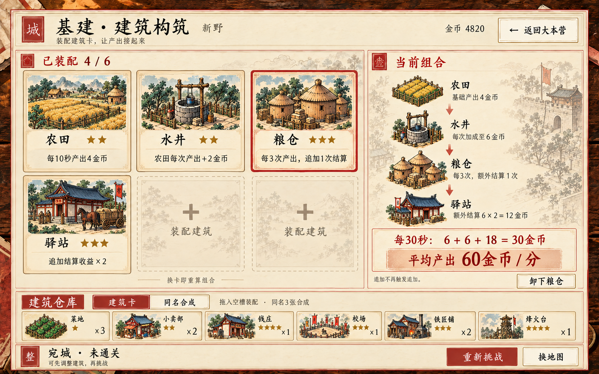

# 基建：装配建筑卡形成组合

日期：2026-10-07。此图为美术参考；其建筑卡装配与组合玩法现已实装，见[完整规则、30种建筑与合成使用说明](建筑卡组合实施说明.md)。

## 新界面

- 主区域：6个建筑卡装配槽，本例4张已装配、2个空槽。选择、换卡与卸下直接作用于该城编组。
- 右侧：显示来源、加成、追加、倍率如何接起来，以及完整周期的平均产出。
- 底部：建筑卡仓库与同名合成页签，拖入空槽装配；保留战果、重新挑战与换地图。
- 建筑表现为有姓名、星级、插画和短效果的实体印刷卡；移除建筑Lv与金币升级按钮，成长通过建筑卡合成表现。

## 图中示意组合

| 建筑卡 | 图中示意效果 | 接线职责 |
|---|---|---|
| 农田★2 | 每10秒产出4金币 | 产出来源 |
| 水井★2 | 农田每次产出+2金币 | 单次产出加成 |
| 粮仓★3 | 每3次农田基础产出，追加结算一次同值收益 | 增加结算次数 |
| 驿站★3 | 追加结算的金币收益×2 | 放大追加收益 |

三个周期分别为6、6、6+12金币，30秒共30金币，平均60金币/分。该四卡原版组合已按上述数值接入游戏，品相及全局加成会进一步影响实际收益。

追加结算不推动粮仓计数，也不触发新的追加；倍率只施加一次。组合按卡面触发范围连接，不依赖摆放顺序，不要求收齐指定四张才激活隐藏套装。替换建筑后应重算组合，缺少来源或条件的词条标为休眠。

未来建筑可以分别提供稳定来源、属性/类型加成、周期追加、追加倍率、容量与训练助力。高星增强自身数值或作用范围，低星通过供给、条件或计数接口继续参与组合，不让所有建筑都变成只有金币/小时的同质升级。

## 素材

- 新图：`base-combo-reference-v2.png`。
- 完整生成提示词：`base-combo-reference-v2.prompt.txt`。
- 方式：内置 ImageGen，使用 `base-reference-v1.png` 为风格参考；旧图保留。
