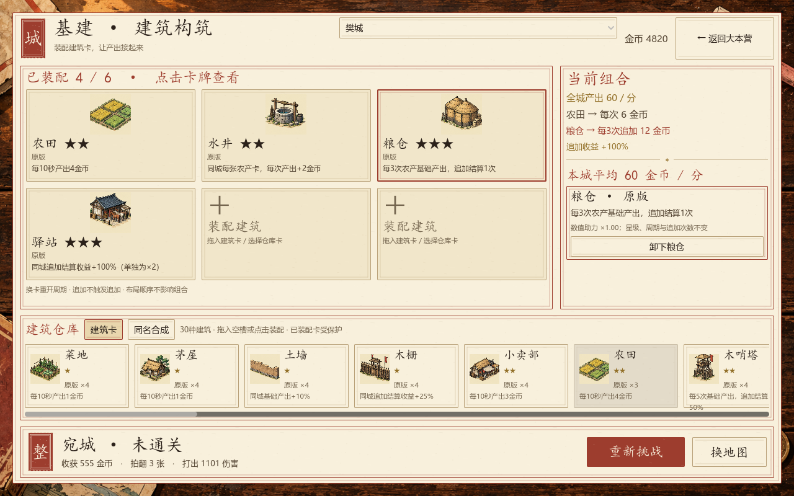
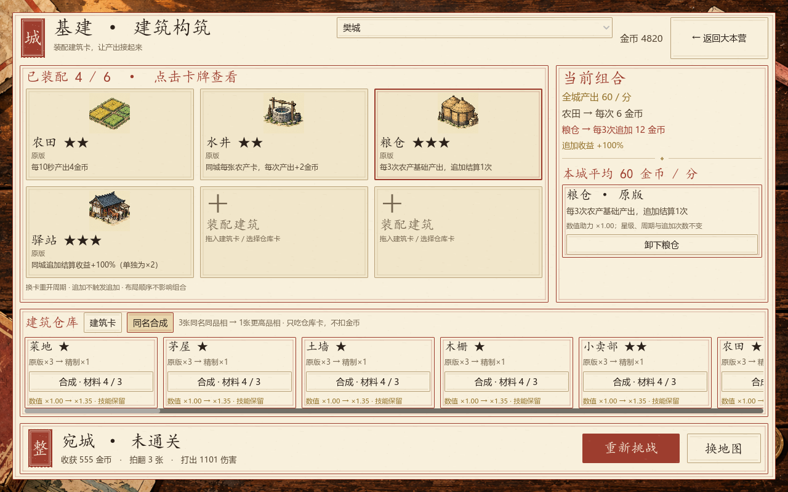

# 基建建筑卡构筑与同名合成 · v1.6 实施说明

2026-10-07，已接入 Godot 游戏规则和实际操作页。沿用现有建筑插画及全部30个卡牌ID。

## 如何使用同名合成

进入大本营 → 基建 → 底部「同名合成」。每个配方显示仓库材料数量和下一品相，材料不足时显示还差几张。

- 3张同名原版 → 1张同名精制，数值系数1.00 → 1.35。
- 3张同名精制 → 1张同名珍藏，数值系数1.35 → 1.80；珍藏封顶。
- 不扣金币，名称、固定星级、触发范围、周期、追加次数保留。不同名字或不同品相不混合。
- 已装配卡不计入仓库材料，不会误吃。例如装配1张农田且仓库3张农田，可合成仓库的3张；装配1张、仓库2张则缺1张。
- 合成结果回仓库。需要先卸下原建筑，再点击或拖入新卡替换；不自动替换已装配卡。
- 品相强化来源金币、固定加成、百分比助力及追加收益系数；不增加触发频率。例如精制粮仓仍每3次触发1次，追加收益为原版的1.35倍。

## 装配与组合

克服三处非起点区域解锁基建；每个可经营城市至少6槽。同城同名只装配1张，不同城市可以装配同名副本。点击空槽，再点仓库卡装配，也可拖到指定空槽；城市内拖拽可交换位置。选中卡牌，在右侧卸下，原品相卡返仓。仓库横向滚动查看全部持有卡。

来源、加成、追加、追加倍率按词条组合，不依赖相邻摆放或先后顺序；缺少来源或类型条件的追加效果显示休眠。功能建筑的全局「唯一」效果，跨城同名只取最强品相；不同名称仍可组合。烽火台为非唯一，可跨城叠加，离线上限仍受24小时封顶。

每10秒一次基础周期，追加不推进基础计数，不触发下一次追加。同层百分比相加，基础与追加各只结算一次。品相和全局加成参与实际在线、离线计算；平均金币/分钟为完整组合的长期平均，发钱发生在周期结算时。

| 示例 | 第1次 | 第2次 | 第3次 | 30秒总额 |
|---|---:|---:|---:|---:|
| 农田＋水井＋粮仓＋驿站（全部原版） | 6 | 6 | 6＋12 | 30 |

农田4＋水井2＝6；粮仓第三次追加6，驿站将追加收益放大为12。平均60金币/分。低星木栅可进一步把追加加成提高到125%，同层相加后追加倍率为2.25。

推荐组合：农产（农田/菜地＋水井＋粮仓＋驿站），工坊（铁匠铺/兵器库＋校场＋望楼＋驿站），多产业（天坛＋农田＋铁匠铺/水寨＋学舍）。余下槽可放全局助力。高星强来源与低星接口均能发挥作用。

## 现有建筑总表

共30种。原导出卡池分类为22种产出建筑、8种功能建筑；本轮22种已拆成10种来源（含天坛混合效果）与12种组合助力，另8种保留全局功能。下表显示原版基础词条，精制/珍藏按上述系数强化数值。

| ID | 名称 | 固定星级 | 组合职责 | 原版效果 |
|---|---|---|---|---|
| B01 | 菜地 | ★1 | 来源 | 每10秒产出1金币 |
| B02 | 茅屋 | ★1 | 来源 | 每10秒产出1金币 |
| B03 | 土墙 | ★1 | 基础加成 | 同城基础产出+10% |
| B04 | 木栅 | ★1 | 追加倍率 | 同城追加结算收益+25% |
| B05 | 小卖部 | ★2 | 来源 | 每10秒产出3金币 |
| B06 | 农田 | ★2 | 来源 | 每10秒产出4金币 |
| B07 | 木哨塔 | ★2 | 追加 | 每5次基础产出，追加结算50% |
| B08 | 水井 | ★2 | 基础加成 | 同城每张农产卡，每次产出+2金币 |
| B09 | 铁匠铺 | ★3 | 来源 | 每10秒产出8金币 |
| B10 | 校场 | ★3 | 基础加成 | 同城工坊基础产出+25% |
| B11 | 粮仓 | ★3 | 追加 | 每3次农产基础产出，追加结算1次 |
| B12 | 驿站 | ★3 | 追加倍率 | 同城追加结算收益+100%（单独为×2） |
| B13 | 望楼 | ★4 | 追加 | 每5次基础产出，追加结算1次 |
| B14 | 水寨 | ★4 | 来源 | 每10秒产出16金币 |
| B15 | 学舍 | ★4 | 基础加成 | 每种不同产出类型，基础产出+5% |
| B16 | 钱庄 | ★4 | 基础加成 | 同城商贸基础产出+50% |
| B17 | 都督府 | ★5 | 基础加成 | 同城基础产出+30% |
| B18 | 铜雀台 | ★5 | 追加 | 每4次基础产出，追加结算50% |
| B19 | 水军大寨 | ★5 | 来源 | 每10秒产出32金币 |
| B20 | 兵器库 | ★5 | 来源 | 每10秒产出32金币 |
| B21 | 王城 | ★6 | 来源 | 每10秒产出64金币 |
| B22 | 天坛 | ★6 | 来源＋追加 | 每10秒产64金币；3种产出类型时，每3次追加50% |
| B23 | 点将台 | ★4 | 全局功能 | 卡组战力 +15% |
| B24 | 藏经阁 | ★4 | 全局功能 | 卡包价格 -10% |
| B25 | 烽火台 | ★4 | 全局功能 | 离线上限 +4 小时 |
| B26 | 演武场 | ★4 | 全局功能 | 体力上限 +5 |
| B27 | 聚宝盆 | ★5 | 全局功能 | 所有建筑产出 +20% |
| B28 | 军械坊 | ★5 | 全局功能 | 装备效果 +10% |
| B29 | 招贤馆 | ★6 | 全局功能 | 招降成本 -25% |
| B30 | 讲武堂 | ★6 | 全局功能 | 卡组战力 +25% |

## 存档与结算

- 存档保存仓库品相、各槽品相、未满10秒的进度与追加计数；重进游戏继续该周期。
- 换卡、卸下或交换槽位重开该城周期，防止把即将结算的卡在城市间搬运刷收入；仓库合成不重开已装配城市周期。
- 离线使用相同周期与追加规则，仍应用原有离线效率和时长上限；结算后立即保存，重载不会重复领取。
- 旧档建筑按原版迁移，旧金币强化费用按历史公式一次性返还；同城旧重复建筑安全返仓。保留旧档原建筑和最近战果。
- 建筑从旧「混合三张同星随机升星」入口移出，只走基建页同名合成。武将、士兵、装备的现有游戏规则不在此次变更范围内。

## 验证与开发入口

建筑规则88项、真实构筑/基建按钮88项、战果79项、四区入口51项、印刷布局5551项通过；核心自检失败0项。实际渲染1280×800与1280×720，装配槽、仓库、战后按钮均可见。

真实鼠标输入验证：仓库卡拖入第六槽成功，已装配卡拖动到第一槽成功（`tests/BuildingDragTest.tscn`）。

- `scripts/building_traits.gd`：结构化组合规则、品相系数与批量结算公式。
- `scripts/autoload/game_state.gd`：装配/卸下/交换/同名合成、全局加成、在线离线与迁移。
- `scripts/city_view.gd`：六槽建筑卡、组合信息、仓库与合成页签。
- `tests/BuildingComboTest.tscn`：组合、合成保护、品相、离线、旧档迁移与拖放接线。
- `tests/Screenshot.tscn -- --building-combo` / `--building-fusion`：独立展示存档截图。

全部数字为当前已实现版本；长流程经济平衡后续以游玩数据调整。没有新增建筑种类或覆盖上游生成的JSON，运行时效果覆盖由结构化规则管理。
