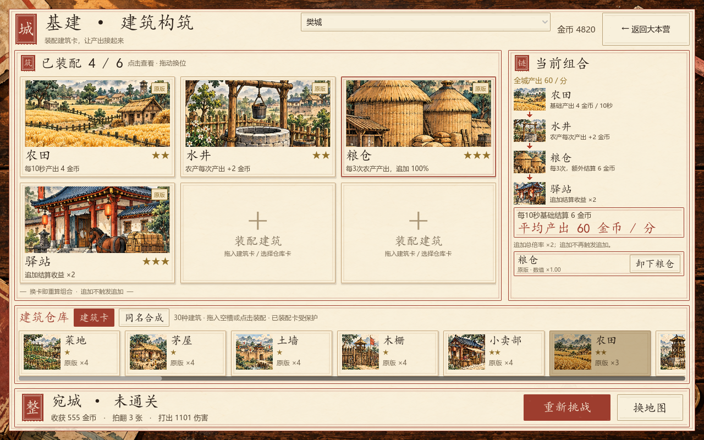
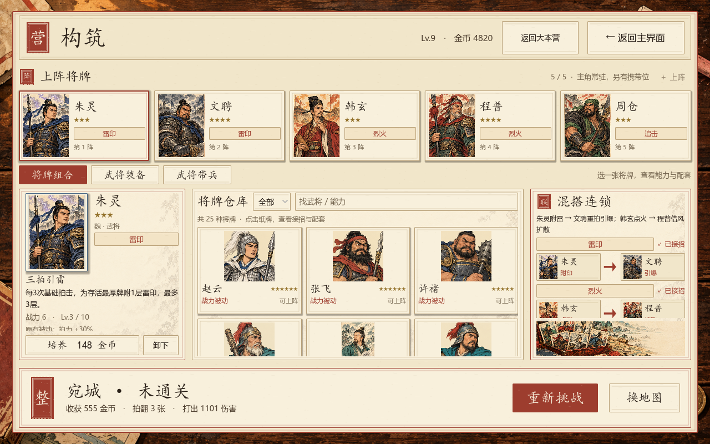

# 基建与卡组构筑美术精修 · v1.7

2026-10-07。按用户的新参考图，使用内置ImageGen生成生产素材，并接入两张实际游戏界面。

## 生成与素材

新增30种建筑完整场景与6名核心连招武将肖像，共36幅卡面插画；另生成构筑场景横幅和淡山水纸纹。保持旧纸、墨线、朱红、靛蓝、玉绿与收获金的印刷质感。

| 项目素材路径 | 内容与映射 |
|---|---|
| `assets/art_v7/buildings_a.png` | 4列3行，B01—B12 |
| `assets/art_v7/buildings_b.png` | 4列3行，B13—B24 |
| `assets/art_v7/buildings_c.png` | 3列2行，B25—B30 |
| `assets/art_v7/heroes.png` | 3列2行，G04朱灵、G05文聘、G30韩玄、G40程普、G20周仓、G24马良 |
| `assets/art_v7/deck_scene.png` | 朱红牌盒与将牌横幅 |
| `assets/art_v7/paper.png` | 淡山水与纸纤维背景 |

使用用户附件为风格参考。原生成文件保留；最终生产文件均已复制到工程。无额外图像改画，图集由Godot AtlasTexture按固定格位采样，1%边缘裁切避免邻格串入。完整原始提示词与输出来源见[生成记录](../../assets/art_v7/generation.json)。

## 基建页

六槽大场景建筑卡，插画约占卡高60%；名称、金色星级、品相角签和当前品相效果由代码绘制。右侧用建筑小图及朱红箭头展示来源、助力、追加和倍率，按真实组合数值计算平均收益。仓库及同名合成加入场景预览，选中卡可卸下。

支持800及720高度，720压缩卡面和组合行高。金币tick保持节点与选择；拖放期间推迟结构刷新，拖放结束后统一更新，避免删除仍被鼠标引用的卡。

## 构筑页

上方大幅武将阵位纸卡；下方为所选卡能力、将牌仓库和组合图解。新肖像用于六名已经接入战斗的武将。雷印、烈火、追击以头像起手→接招呈现，缺少搭档灰化。

核心能力优先显示，上阵/卸下/培养按钮固定在详情滚动区外；装备与派兵页签仍可操作。仓库搜索、过滤与滚动保留，金币tick不重建卡格。三个主面板加入低对比生图纸纹，构筑横幅在首屏可见。

## 验证

- 真实页面操作88项通过，包括选择、搜索、培养、换装、派兵、建筑装配/卸下/合成，以及战后返回、重试和地图。
- 印刷全卡与布局5551项通过；建筑组合、品相与存档88项通过。
- 真实鼠标输入：仓库卡拖入第六槽成功，已装配卡移动到第一槽成功。
- 已实机渲染1280×800与1280×720，保留失败重新挑战/换地图及通关后的大地图入口。

此次修改资源层和界面显示，不替换武将/士兵的目标构筑规则；原版→精制→珍藏建筑合成及在线离线周期仍用v1.6实现。自动拍与全卡新流派仍属于此前规划。
