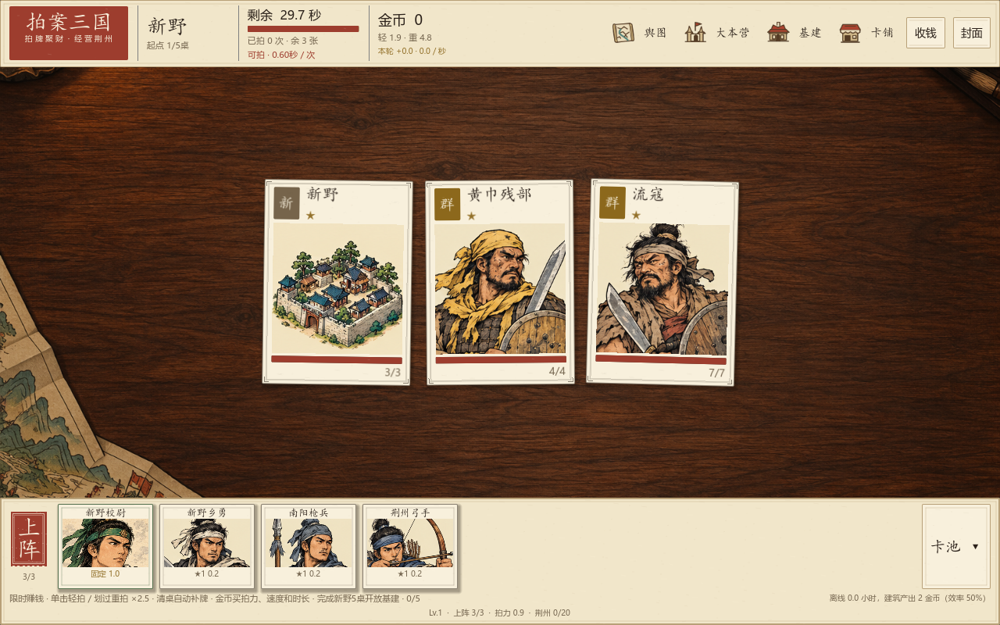
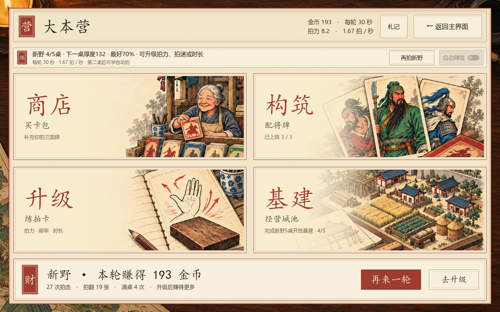
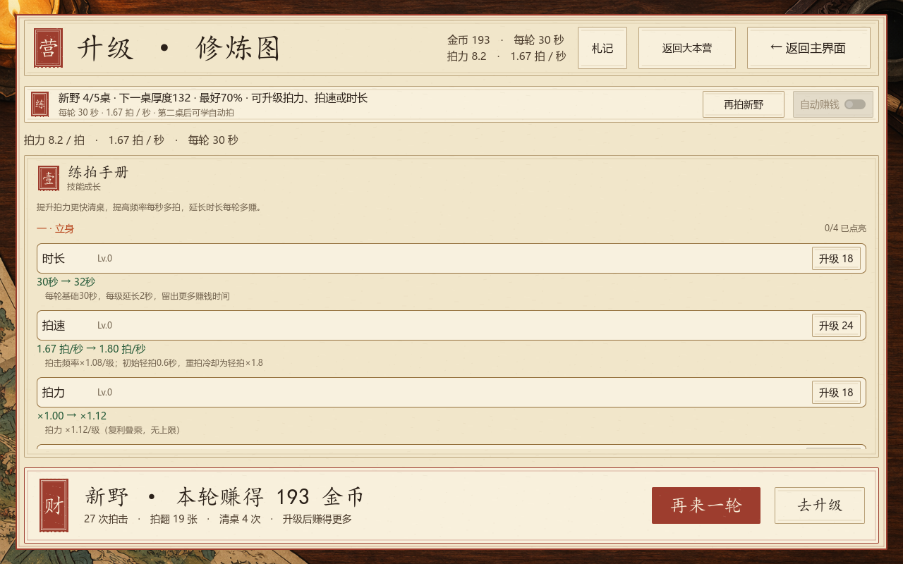
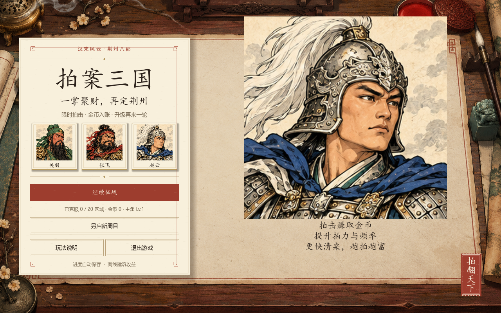

# 拍案三国：限时拍击赚钱版 v2.0

2026-10-08。此版取代旧“操场荆州”和“耐力耗尽回营”的运行规则；历史策划与美术册保留作为版本记录。

## 参考与取舍

参考 [Incremental Fishing 的 Steam 官方页面](https://store.steampowered.com/app/4456630/Incremental_Fishing/)所展示的获取收益、购买升级、推进区域。这里将操作对象转换为三国将牌，沿用纸牌与木案美术。

以下 30 秒轮长与拍击冷却是本项目此次调整的设计参数，不是对参考游戏数值的描述。

## 当前核心循环

开一轮 → 在倒计时内拍牌即时赚金币 → 翻完一桌自动补牌 → 到期带着全部收入回营 → 买升级 → 下一轮拍得更多、赚得更多。

| 项目 | 当前规则 |
| --- | --- |
| 基础轮长 | 30 秒 |
| 轻拍 | 单击一张牌；初始间隔 0.6 秒 |
| 重拍 | 按住划过多张牌，在松开时一起拍击；伤害 ×2.5，冷却为轻拍 ×1.8 |
| 一掌的次数 | 一次多牌划掌算一次动作，不能重复命中同一张、不能跨到自动补出的新桌 |
| 收入 | 按实际打出的有效伤害即时入账；翻牌、清桌追加奖金 |
| 轮结束 | 倒计时到零或主动“收钱”；已入账收入不再次发放 |
| 整备 | 打开手动整备、札记、卡池等页面时暂停计时 |
| 城市进度 | 各桌第一次完成推动城市解锁；城市首通后仍继续本轮采集 |
| 重刷 | 末桌与已开城市可继续赚钱；将牌、城池、亲和首通奖励仅发一次 |

“每秒收入”使用本轮实际金币除以实际经过时间。金币保留小数精度，最终金币与拍数保存为最近轮次战果。

## 金币升级的三个主要方向

- **拍力**：提高每次有效拍击的伤害和收入。
- **拍速**：每级提升频率 ×1.08，缩短冷却；初始 1 / 0.6 ≈ 1.67 拍 / 秒。
- **时长**：基础 30 秒，每级增加 2 秒；沿用旧存档 `stamina` 键，原有时长相关武将和建筑词条继续生效。

武将构筑、装备、同名合成和建筑组合继续作为效率来源。主动拍击是早期核心，自动拍只提供部分拍力与更慢的拍击节奏；持续自动轮结束后休息再开下一轮。离线收益使用保守估算，不提前计算暴击与构筑的额外收益。

## 纯古代三国设定

故事从汉末新野的军营与集市开始。主角是驻守新野的校尉，纪事人物使用关平、周仓、马良、关羽。封面、牌桌、剧情场景都使用古代木案与营地。

| 旧 ID | 当前人物 / 建筑 | 当前肖像来源 |
| --- | --- | --- |
| I01 | 新野校尉 | 已有古代关平肖像 |
| G00 | 荆州壮士 | 已有古代周仓肖像 |
| G56 | 荆州游侠 | 已有古代赵云肖像 |
| B05 | 杂货铺 | 既有建筑场景 |

角色替换集中在 `scripts/ancient_setting.gd` 的运行时覆盖层；原始生成数据、卡牌 ID、收藏数量、星级、旧存档继续兼容。当前三名替换角色复用已有古代肖像，后续可分别绘制独立肖像。

## 本轮实际画面

## 验证入口

使用 Godot 4.7 系列，先 `--headless --path . --import`。

- `tests/SelfTest.tscn` / `tests/IncrementalTest.tscn`：当前限时循环、升级、冷却、批次拍击、到期伤害、自动轮、存档和真实页面入口。
- `tests/PrintTest.tscn`：全部卡牌图像、明确的古代肖像复用例外、布局与收藏筛选。
- `tests/BuildingComboTest.tscn`：建筑装配、合成、周期收益、离线收益与旧强化返还。
- `--script res://tests/ancient_setting_test.gd`：生成数据的设定覆盖、数值保留、剧情与已读纪事兼容。

验证场景使用独立测试存档。旧 `tests/selftest.gd`、Outcome/Hub/BuildTraits 里的耐力扣除、清桌结束等断言记录旧版规则，不作为 v2.0 验收入口；SelfTest 场景已经指向新循环自检。

本机 Godot 4.7.1 实际验证：新循环 444 项、卡牌与布局 5,551 项、建筑组合 88 项均通过，古代设定独立回归通过。1280×800 的牌桌、结算、升级与封面，以及 1280×720 的结算画面均已渲染并检查，无报错或布局遮挡。
